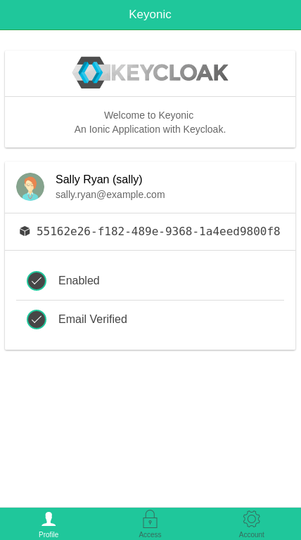
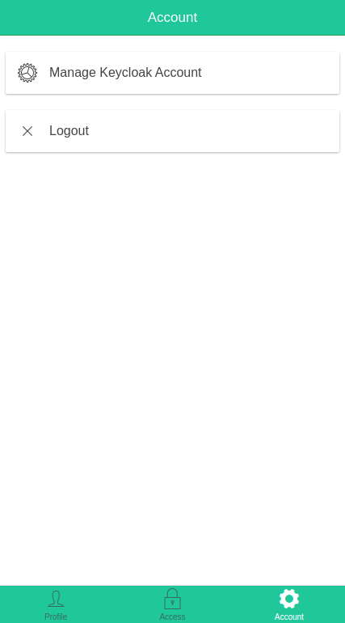

# Keyonic
## Description
A simple Keycloak Sample Mobile App with Ionic & Angular. This is a small app that shows the majority of the functions in the Keycloak JS Adapter.

## Setup
Run `ionic serve --address localhost` to start the application.

Ensure that you have the Web Origin configured in Keycloak. eg `*` or other.

## Keycloak Configuration
The following configuration was used for this application.

```
var keycloak = Keycloak({
  "realm": "keypress",
  "url": "http://localhost:8080/auth",
  "ssl-required": "external",
  "clientId": "keypress-mobile",
  "public-client": true,
  "use-resource-role-mappings": true
});
```
You can import the Keycloak Realm and Users JSON files [here](https://github.com/TommyJ1994/keypress/tree/master/keycloak) to populate Keycloak with the correct configuration.

* Under the Realms section in Keycloak, add a new Realm with the Import option.
* Import the keypress-realm.json file.
* Once complete, visit the newly created realm and click the 'Import' button at the bottom left of the sidebar. You will import the users here. Choose the keypress-users-0.json file.

## Access Control Functionality
Some UI elements are shown/hidden under the Access tab based on the logged in users role. These roles are:
* admin
* driver
* management
* backoffice

## Example UI
### User Profile
The user profile screen will show information about the logged in user. You can also retrieve user Attributes this way.



### User Access
From here, you can see what auth server you have authenticated against, the realm you are using, and the client that you are interacting with Keycloak through. You can also see what Account Access Roles and Realm Roles have been granted to the user. Lastly, the Access Control list will show a role name UI element if they have that role, otherwise a role name UI component will not be shown if they do not have that role.


### User Account
The account tab will allow you to manage your account (update some details like your password etc) and also logout.


